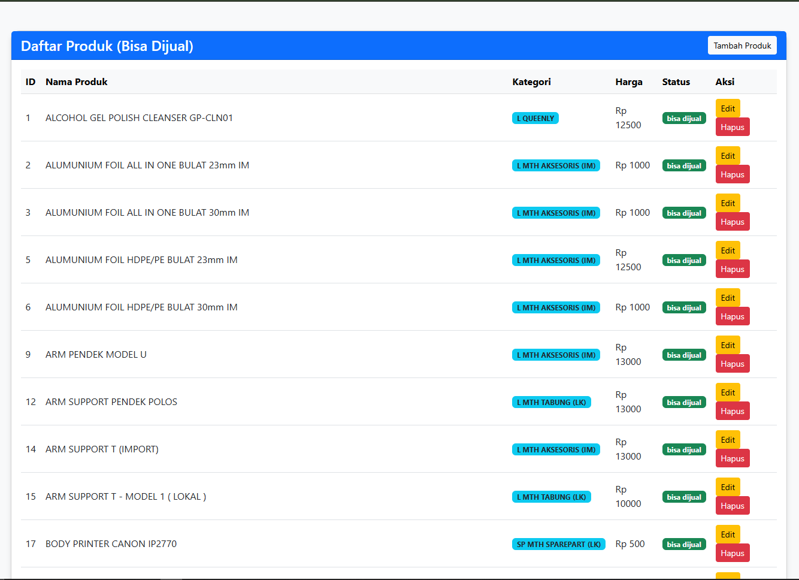
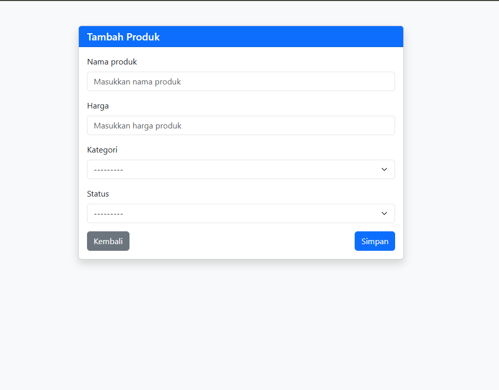
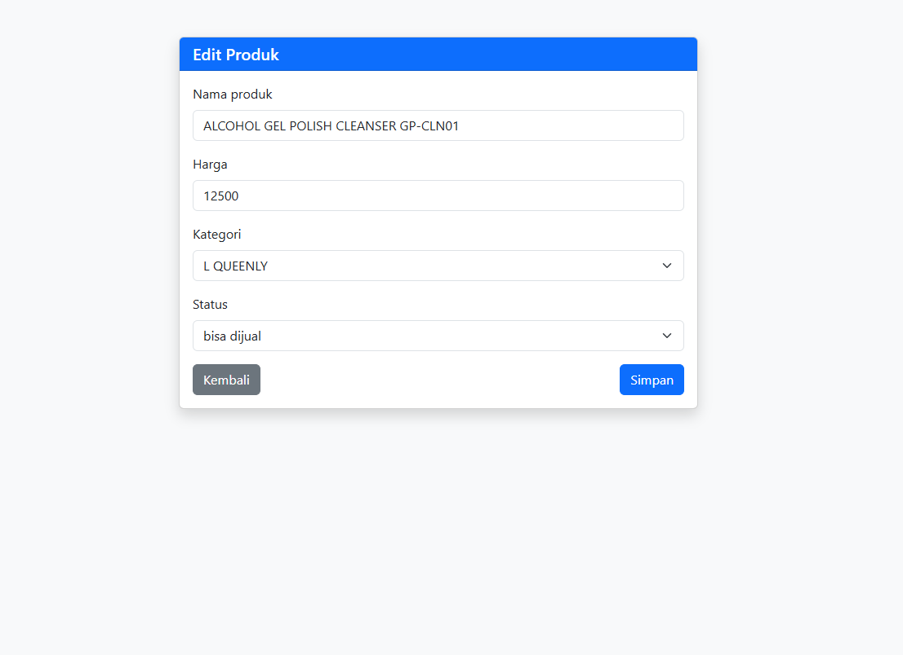

# Tes Programmer FastPrint - Manajemen Produk
Aplikasi Fullstack Django untuk mengambil data produk dari API FastPrint, menyimpannya ke database lokal, dan mengelolanya melalui Web Interface.
### Halaman Utama Tabel produk


Di halaman utama menampilakn produk dengan status "bisa dijual"

### Alert Konfirmasi Hapus Data


Alert digunakan untuk konfirmasi hapus data mencegah hapus data yang tidak sengaja, saya menggunakan library sweetAlert4 untuk mempercantik tampilan dari alert().

### Tampilan From Tambah dan Edit Data




Untuk Validasi Form saya menggunakan fitur bawaan django forms, dan juga pada form input harga tidak boleh memasukkan nilai kurang dari 1.


## 🛠 Teknologi yang Digunakan
* **Backend:** Python 3.10+, Django 5.x
* **Database:** PostgreSQL
* **Frontend:** Django Templates, Bootstrap 5, SweetAlert2
* **Tools:** Django REST Framework (untuk Serializer), Requests

## 🚀 Fitur Utama
1.  **Auto-Sync API:** Script otomatis untuk menarik data dari API dengan otentikasi dinamis (MD5 + Date).
2.  **Smart Validation:** Menggunakan Serializer untuk memvalidasi data JSON sebelum masuk database.
3.  **CRUD System:** Fitur Tambah, Edit, dan Hapus produk.
4.  **Filtering:** Halaman depan otomatis memfilter produk status "Bisa Dijual".

## 📦 Cara Instalasi

### 1. Clone & Setup Environment
```bash
# Clone repository ini 
git clone https://github.com/Solakhuddin/fastprint.git
atau donwload file .zip 

# Masuk ke folder
cd fastprint

# Buat Virtual Environment agar dapat diaktifkan secara universal
python -m venv venv

# Aktifkan Virtual Environment
# Windows:
venv\Scripts\activate
# Mac/Linux:
source venv/bin/activate
```
### 2. Install Dependencies
```bash
pip install -r requirements.txt
```
### 3. Konfigurasi Database
1. Buat database baru di PostgreSQL bernama fastprint, disarankan menggunakan pgAdmin4.
2. Sesuaikan file "settings.py" pada bagian DATABASES dengan username & password PostgreSQL Anda.

### 4. Migrasi Database
Lalu migrate database dengan menjalankan command
```bash
python manage.py makemigrations
python manage.py migrate
```

## ⚙️ Cara Menjalankan Aplikasi

### Langkah 1: Tarik Data dari API yang disediakan
Jalankan perintah custom berikut untuk mengisi database:
```bash
cd firstproject
python manage.py ambil_data
```
Script akan menghubungi API, melakukan generate password dinamis, dan menyimpan data ke PostgreSQL.

### Langkah 2: Jalankan Server Web
```bash
python manage.py runserver
````
Buka browser dan akses: http://127.0.0.1:8000/